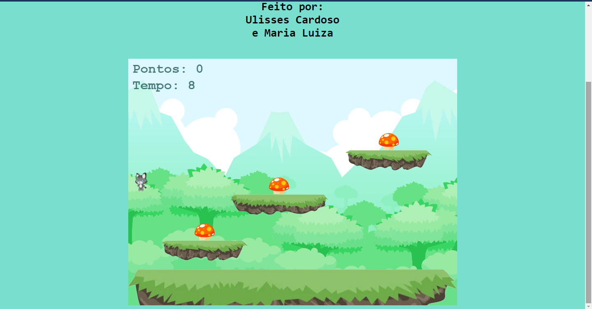

<div align="center">

# Cat Run 🍄🐈💨


[](https://phaser.io/)

    
 			

Cat Run é um jogo que consiste em uma gata (chamada Lia) tendo que pegar 3 cogumelos para atingir mais de 5 pontos.
</div>

## Licença
[](https://opensource.org/licenses/MIT)


## 🔨 Tecnologias:

Feito com Phaser 3 (3.55.2) — _Este projeto NÃO foi feito usando a IDE não oficial da Photon Storm: "Phaser Editor 2D"._


## 🎮 Gameplay 🎥🎦 + Prints 🖼️ 📸

<div align="center">
 

 
</div>

https://github.com/Ulix-50/CatRun/assets/118901475/66956739-30cb-4232-85f3-6313e23c7b2c


## 🎯 Objetivo/Finalidade

O jogo é um projeto escolar — de 2022, porém com algumas modificações feitas recentemente🤓 — feito para mostrar nossas habilidades com o framework Phaser 3. Aproveitei e apliquei práticas do Clean Code no projeto também 😁


## 🫰🏾 Agradecimentos:

* Escola ETEC Aristóteles Ferreira pela oportunidade de realizar esse projeto como uma avaliação/prova. Esse é um projeto que mesmo simples, me dá muito orgulho!
* Minha amiga Malu (Maria Luiza) que esteve comigo no projeto 🫶🏾

## 🎮 Como jogar?


O jogador (Lia) deve pegar todos os 3 cogumelos para atingir mais de 5 pontos. Após pegar todos os cogumelos, Lia fica imobilizada, sem conseguir se mexer. O jogo tem um timer de 10 segundos. 

https://github.com/Ulix-50/CatRun/assets/118901475/997a8649-f9a2-4467-9a84-94b5f8ca76e2


Caso o tempo acabe e o jogador não tenha pego todos os cogumelos, o jogador perde, não podendo mais pegar qualquer cogumelo.

https://github.com/Ulix-50/CatRun/assets/118901475/3828bba0-b8ed-4333-b24d-e10f2939f77d

## 🕹 Onde acessar?

Clique >[aqui](https://ulix-50.github.io/CatRun/)< para acessar o jogo online :D 


## ⬇ Como instalar na sua máquina?

 - Instale o servidor web XAMPP;

	

 - Ao fazer o download do repositório, coloque-o na pasta ```htdocs```
   dentro da pasta dos arquivos do XAMPP;

		

 - Abra o Painel de Controle do XAMPP ("XAMPP Control Panel"), e clique
   no botão start na linha onde está escrito "Apache";

		

 - Acesse o site/link ```localhost/{Nome da Pasta}``` (Nome da Pasta nesse caso
   "CatRun") para ter acesso ao arquivo.

		
	

 Pronto! Agora você tem um servidor local carregando uma página  ^ _ ^.

**/***
_Caso você esteja tentando atualizar a página no_ `F5` ou `Ctrl + R` _e não funcione, teste_ **`Ctrl + Shift + F5`** _ou_ **`Ctrl + Shift + R`** _para reinicar a página ignorando o cache ;)_
***/**

### ⚠ Avisos:
 * Não altere os nomes dos arquivos internos, principalmente o **index.html**; Já que o XAMPP procura por "index.html" para executar uma pasta.


 ## 👥 Créditos:
 * Sprites: [Cat & Dog - Free Sprites - Sprites do site Open Game Art](https://opengameart.org/content/cat-dog-free-sprites)

 * Background: [FREE PLATFORMER GAME TILESET - gameart2d.com](https://www.gameart2d.com/free-platformer-game-tileset.html)
 * Música usada:
    Título: [Mushrooms](https://freemusicarchive.org/music/Komiku/Captain_Glouglous_Incredible_Week_Soundtrack/bibliothque)   
	  Artista: [Komiku](https://freemusicarchive.org/music/Komiku/)


